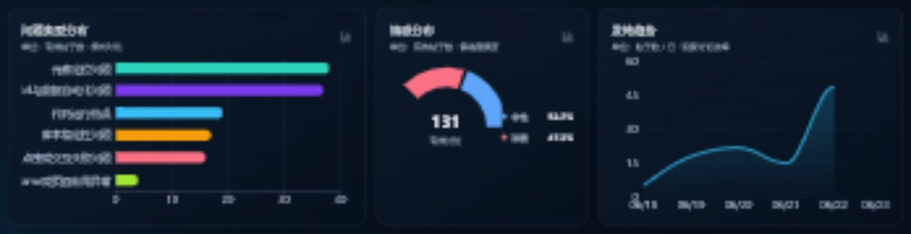
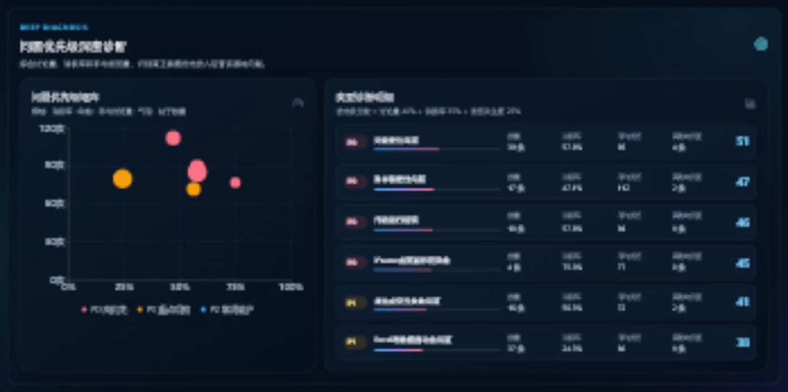
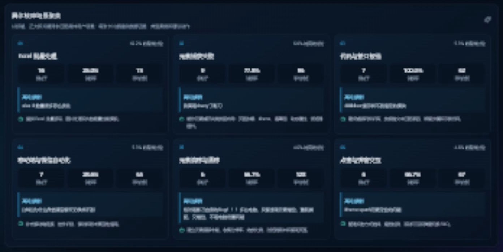

# 社区数据运营分析看板图文说明

## 一、项目概述

本项目基于 `情感分析.xlsx` 中的真实社区帖子数据，对帖子数量、有效性、问题类型、用户情感、浏览量、关键词、作者、发布时间和分类置信度进行清洗与分析，并以交互式 BI 看板的形式展示结果。

本次共分析 **200 条社区帖子**，其中：

- 有效帖子：**131 条**
- 无效内容：**69 条**
- 无效内容占比：**34.5%**
- 有效帖子平均浏览量：**86 次**
- 消极反馈：**62 条**
- 消极反馈占有效帖比例：**47.3%**
- 低置信度待复核数据：**13 条**

---

## 二、顶部概览

### 模块介绍

顶部概览用于快速了解社区数据的整体规模和当前运营健康度，是运营人员进入看板后首先关注的区域。

页面提供问题类型、情感、关键词、数据状态和文本搜索等全局筛选条件。筛选后，页面中的指标卡、图表、帖子排名和深度分析模块会同步更新。

### 核心指标说明

| 指标 | 结果 | 含义 |
| --- | ---: | --- |
| 帖子总量 | 200 条 | Excel 中经过重复识别后的帖子总数 |
| 有效帖子 | 131 条 | 具有有效正文和分析标签、可用于问题洞察的帖子 |
| 有效率 | 65.5% | 有效帖子占全部帖子的比例 |
| 主要问题类型 | 元素定位问题 | 当前讨论数量最多的问题分类 |
| 消极反馈占比 | 47.3% | 有效帖子中带有明显负面情绪的比例 |
| 平均浏览量 | 86 次 | 131 条有效帖的平均关注度 |

### 数据解读

社区中约三分之一的数据被标记为无有效内容，说明部分帖子只有标题、图片或缺少可分析正文。后续采集任务可以考虑同步提取图片 OCR、附件和评论内容，提升有效数据比例。

消极反馈比例接近一半，说明社区内容不仅是普通功能咨询，还包含大量故障、失败和使用受阻场景，需要建立更及时的问题响应机制。

---

## 三、基础分布与发帖趋势

### 模块介绍

该区域从问题类型、情感和时间三个基础维度展示社区讨论结构，回答以下问题：

1. 用户主要在讨论什么问题？
2. 社区整体情绪是否健康？
3. 哪些日期出现了讨论高峰？

### 问题类型分布

| 问题类型 | 数量 | 有效帖子占比 |
| --- | ---: | ---: |
| 元素定位问题 | 38 条 | 29.0% |
| Excel 与数据自动化问题 | 37 条 | 28.2% |
| 代码运行错误 | 19 条 | 14.5% |
| 脚本稳定性问题 | 17 条 | 13.0% |
| 点击或交互失败问题 | 16 条 | 12.2% |
| iframe 或页面布局异常 | 4 条 | 3.1% |

“元素定位问题”和“Excel 与数据自动化问题”合计占有效帖的 **57.3%**，是最值得优先建设帮助文档和标准解决方案的两个方向。

### 情感分布

- 中性帖子：**69 条，占 52.7%**
- 消极帖子：**62 条，占 47.3%**
- 当前数据中没有被标记为积极的帖子

消极内容比例较高，尤其是元素定位、脚本稳定性、代码报错等故障类帖子。建议将“问题类型”和“情感”交叉使用，而不是只观察总帖子数量。

### 发帖趋势

数据时间范围为 **2026 年 6 月 18 日至 6 月 23 日**。

| 日期 | 有效发帖数 |
| --- | ---: |
| 6 月 18 日 | 5 条 |
| 6 月 19 日 | 18 条 |
| 6 月 20 日 | 22 条 |
| 6 月 21 日 | 15 条 |
| 6 月 22 日 | 49 条 |
| 6 月 23 日 | 22 条 |

6 月 22 日出现明显讨论峰值，共有 **49 条有效帖子**。后续可以结合产品版本发布、平台异常或活动记录，判断该峰值是否由集中故障或运营事件引起。

---

## 四、问题优先级深度诊断

### 模块介绍

该模块不再仅按照帖子数量排序，而是同时考虑：

- 讨论量：问题出现得是否频繁
- 消极率：该问题是否容易造成用户不满
- 平均浏览量：该问题是否受到更多用户关注
- 高影响负面帖子：是否存在高浏览量的消极内容

系统根据以上指标生成综合优先级分数，并划分为：

- **P0：高优先级，应尽快处理**
- **P1：重点观察和持续优化**
- **P2：常规维护**

### 诊断结果

| 问题类型 | 数量 | 消极率 | 平均浏览量 | 高影响负面帖 | 优先级 |
| --- | ---: | ---: | ---: | ---: | --- |
| 元素定位问题 | 38 | 57.9% | 85 | 4 | P0 |
| 脚本稳定性问题 | 17 | 47.1% | 112 | 2 | P0 |
| 代码运行错误 | 19 | 57.9% | 89 | 1 | P0 |
| iframe 或页面布局异常 | 4 | 75.0% | 77 | 0 | P0 |
| 点击或交互失败问题 | 16 | 56.3% | 72 | 2 | P1 |
| Excel 与数据自动化问题 | 37 | 24.3% | 80 | 1 | P1 |

### 数据解读

“元素定位问题”同时具备高频、高消极率和多个高影响负面案例，因此是综合优先级最高的问题。

“脚本稳定性问题”的数量不是最多，但平均浏览量达到 **112 次**，是所有主要问题类型中最高的。这意味着脚本失效、卡顿和环境变化等问题具有较强的共鸣性和传播性。

“iframe 或页面布局异常”只有 4 条，但消极率达到 **75.0%**。这类低频、高负面问题不适合仅根据数量判断，应作为疑难问题建立专项排查文档。

“Excel 与数据自动化问题”数量接近第一，但消极率只有 **24.3%**，更多属于需求咨询和方案求助，适合通过教程、模板和案例库进行承接。

---

## 五、具体故障场景聚类

### 模块介绍

该模块根据帖子标题、正文和关键词进行规则匹配，将宽泛的问题类型进一步拆分为可直接采取行动的具体场景。

每个场景卡片包含：

- 相关帖子数量
- 在有效讨论中的占比
- 消极率
- 平均浏览量
- 高关注典型案例
- 对应的运营或产品动作

### 主要场景

#### 1. Excel 批量处理

- 相关帖子：约 16 条
- 主要诉求：批量读写、图片处理、循环复制、数据量较大时的性能优化
- 建议：提供 Excel 批量处理模板，以及大数据量读写的性能最佳实践

#### 2. 元素捕获失败

- 相关帖子：9 条
- 消极率：77.8%
- 平均浏览量：96 次
- 典型表现：找不到元素、重新打开网页后需要重新捕获、页面元素无法识别
- 建议：制作元素捕获失败排查向导，覆盖页面加载、iframe、遮罩层、动态属性和浏览器插件

#### 3. 代码与接口报错

- 主要表现：运行错误、接口异常、错误文本和堆栈信息
- 建议：建设错误码和报错文本知识库，根据错误关键词自动推荐原因和修复步骤

#### 4. 元素偏移与漂移

- 相关帖子：6 条
- 消极率：66.7%
- 平均浏览量：128 次
- 典型表现：元素错位、重新捕获后再次偏移、不同电脑出现相同问题
- 建议：建立元素偏移专项，要求用户提交分辨率、系统缩放、浏览器版本和复现页面

#### 5. 点击与弹窗交互

- 主要表现：点击不到、按钮被遮挡、弹窗切换失败、滑动不生效
- 建议：整理点击方式选择、滚动到可见区域、遮挡检测和弹窗切换 FAQ

#### 6. 移动端与微信自动化

- 主要表现：微信升级后找不到元素、ADB 命令、移动端滑动和控件识别
- 建议：补充移动端连接、版本兼容性、屏幕尺寸和滑动操作指南

---

## 六、FAQ 候选与高影响消极案例

### FAQ 候选模块

FAQ 候选不是仅根据关键词频次生成，而是综合考虑：

1. 相关帖子数量
2. 场景消极率
3. 平均浏览量
4. 是否存在高关注典型案例

建议优先建设以下内容：

- 元素捕获失败排查指南
- 元素错位与页面漂移解决方案
- Excel 批量处理与性能优化教程
- 常见代码报错和接口错误知识库
- 点击失败、遮挡和弹窗切换说明

### 高影响消极案例

右侧列表展示浏览量较高的消极帖子。这类内容意味着问题不仅影响发帖用户，也可能被更多遇到类似问题的用户浏览。

建议为此类帖子设置：

- 自动识别和告警
- 24 小时首次响应 SLA
- 官方解决方案或进展回复
- 问题解决后的状态回访
- 可复用答案沉淀到 FAQ

---

## 七、高频关键词与核心发现

### 高频关键词

当前数据中的主要关键词包括：

| 关键词 | 出现次数 |
| --- | ---: |
| 影刀 | 16 |
| 报错 | 6 |
| 捕获元素 | 6 |
| 价格 | 3 |
| 循环 | 3 |
| 循环相似元素 | 3 |
| 元素偏移 | 3 |
| 找不到元素 | 3 |
| 指令 | 3 |
| Excel | 3 |

关键词进一步证明，用户关注点主要集中在元素操作、错误排查、循环处理和 Excel 自动化。

### AI 核心发现

- 元素定位问题是讨论最多的问题类型，共 38 条
- 消极反馈占有效帖的 47.3%，社区负面情绪需要重点关注
- 元素定位问题贡献的总浏览量较高
- “报错”“捕获元素”“元素偏移”等词反映了用户强烈的排障诉求

关键词标签支持点击筛选，运营人员可以直接查看某个关键词对应的全部指标和帖子。

---

## 八、高关注帖子明细

### 模块介绍

该模块按照浏览量对有效帖子进行降序排列，展示标题、作者、问题类型、情感、浏览量和分类置信度。

### 代表性高关注内容

- “绝对是影刀自身的 Bug，多台电脑反复出现元素错位”：281 次浏览，消极
- “朋友们是否喜欢 RPA 数据自动化这项工作”：272 次浏览，消极
- “我真是 chovy 了影刀”：255 次浏览，元素定位问题，消极
- “学习影刀为什么要学习 Python”：225 次浏览
- “个人如何开通企业版”：197 次浏览

### 数据解读

高浏览量内容同时包含技术故障、职业讨论、账号版本和产品能力咨询。运营团队可以将帖子分为：

- 产品故障类：需要技术支持或官方跟进
- 操作咨询类：适合转化为 FAQ 或教程
- 产品版本类：需要明确的产品说明和购买指引
- 行业讨论类：适合通过话题运营提升社区活跃度

---

## 九、低置信度复核与活跃作者

### 低置信度复核队列

当前有 **13 条记录**的分类置信度低于 0.70，需要进行人工检查。

典型低置信度内容包括：

- 学习 Python 的作用
- ADB 命令查询表
- 账号之间复制应用
- RPA 数据自动化职业讨论
- Codex 操控影刀流程

这些帖子可能同时包含教程咨询、产品功能、职业话题等多个意图，容易被错误归入技术故障分类。

人工修正后的标签可以回流到后续分类任务中，提高 AI 分类稳定性。

### 活跃作者

| 作者 | 有效帖子数 | 累计浏览量 |
| --- | ---: | ---: |
| freejanker | 5 | 398 |
| wszjtc | 4 | 222 |
| 摆烂日常 | 3 | 429 |
| Ethan· | 2 | 247 |
| 191aaa | 2 | 214 |

重复发帖作者可能代表：

- 持续遇到产品问题的用户
- 自动化深度使用者
- 具有多场景需求的高价值用户
- 适合邀请参与访谈或产品共创的社区成员

---

## 十、运营建议总结

### P0：优先建设元素定位帮助中心

元素定位问题共 38 条，占有效内容的 29.0%，且消极率达到 57.9%。建议将相关内容拆分为：

- 找不到元素
- 动态元素识别
- iframe 元素定位
- 相似元素循环
- 元素错位和漂移
- 遮罩层和透明元素干扰

### P0：围绕高频排障诉求补充 FAQ

在社区搜索、发帖页面和客服入口中，根据用户输入的“报错”“捕获元素”“找不到元素”等关键词提前推荐答案，减少重复发帖。

### P1：建立消极反馈快速响应机制

对高浏览量的消极帖子设置自动提醒，优先由官方人员回复，并记录首次响应时间、解决时间和用户是否确认解决。

### P1：使用 Agent 承接标准化排障

Agent 可以在用户发帖或咨询时自动收集：

- 操作系统和浏览器版本
- 影刀版本
- 失败步骤
- 错误文本
- 截图和运行日志
- 是否可以稳定复现

随后根据知识库提供分步排查建议，并在无法解决时转人工。

### P2：建立低置信度人工复核流程

定期复核低置信度分类，将正确结果回流到标签体系，降低职业讨论、产品咨询和技术故障之间的分类混淆。

---

## 十一、总结

本次分析表明，社区当前最需要优先解决的并不是单一的帖子数量问题，而是以下三个方面：

1. **元素定位和脚本稳定性问题具有高频、高负面和高关注特征。**
2. **大量问题具有标准化排查路径，适合通过 FAQ、帮助中心和 Agent 自动承接。**
3. **高影响消极帖子与低置信度分类都需要建立人工运营闭环。**

通过问题发现、优先级判断、自动回答、人工跟进和知识沉淀，可以逐步形成社区数据运营闭环，减少重复问题，提高问题解决效率和用户满意度。
